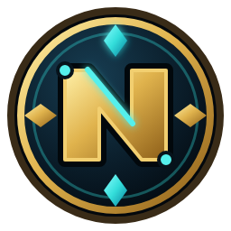
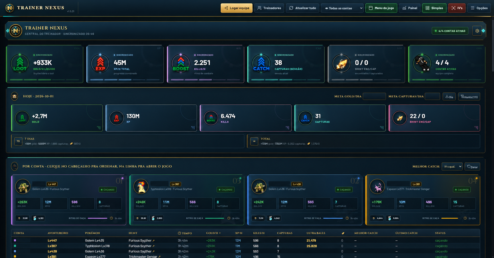
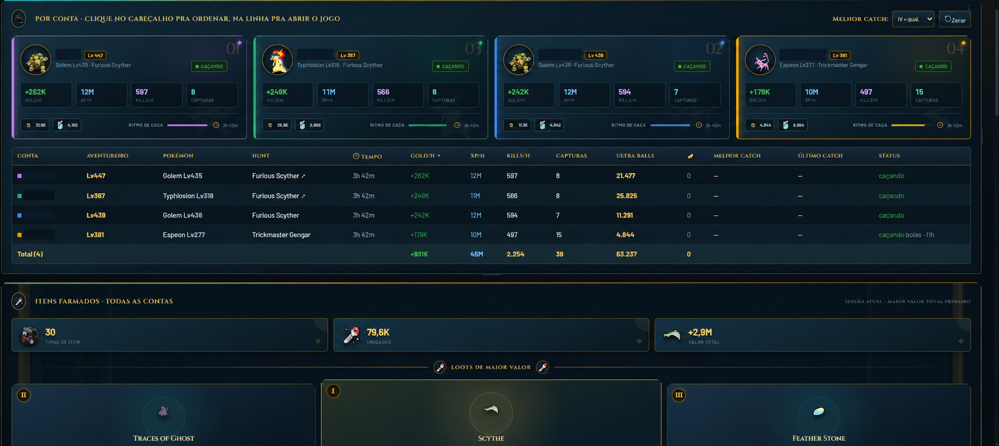
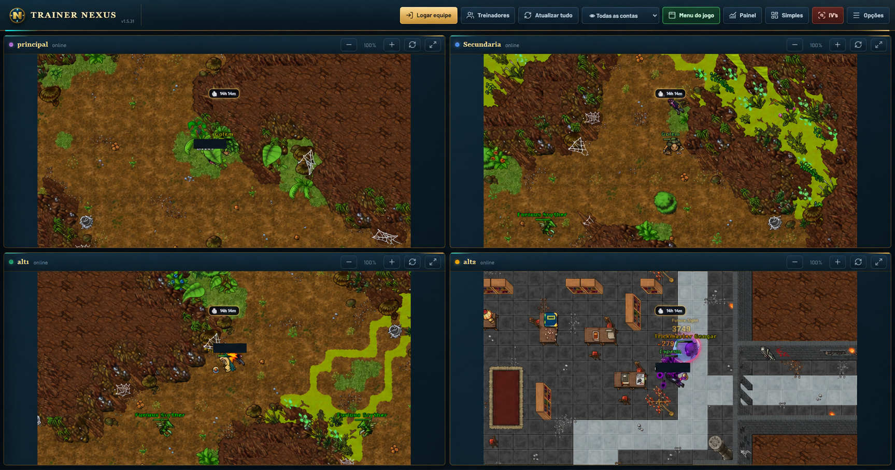
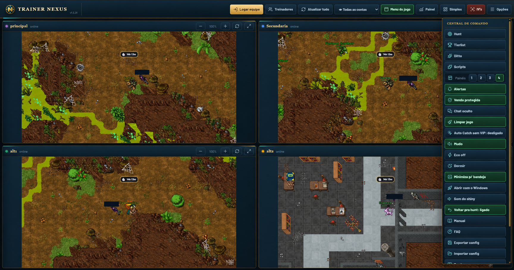
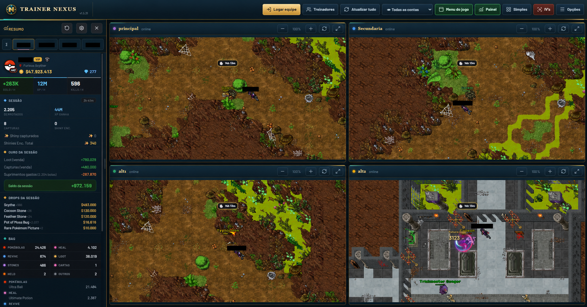

<p align="center">
  
</p>

<h1 align="center">Trainer Nexus</h1>

<p align="center">
  <strong>Sua central de controle para organizar, acompanhar e gerenciar múltiplas contas do Poke Idle World.</strong>
</p>

<p align="center">
  Interface inspirada no universo do jogo, painéis em tempo real e visualização de até quatro contas em uma única janela.
</p>

<p align="center">
  
  
  
</p>

<p align="center">
  <a href="https://github.com/Ashezyn/Nexus-Trainer-Poke-Idle-World/releases/tag/v1.5.33"><strong>⬇️ Baixar o Trainer Nexus 1.5.33</strong></a>
  &nbsp;•&nbsp;
  <a href="#-comece-em-3-passos"><strong>Como começar</strong></a>
  &nbsp;•&nbsp;
  <a href="#-conheça-a-interface"><strong>Conhecer a interface</strong></a>
</p>

---

## ✨ Controle completo sem complicação

O **Trainer Nexus** reúne as informações mais importantes das suas contas em uma interface única. Você pode acompanhar o farm, alternar entre contas, consultar inventário e desempenho ou usar o modo simples quando quiser uma visualização mais leve.

<p align="center">
  
</p>

### Principais recursos

| Recurso | O que ele oferece |
|---|---|
| **Até 4 contas simultâneas** | Acompanhe as contas lado a lado ou abra somente a que deseja visualizar. |
| **Modo Simples** | Exibe estatísticas, recursos e resultados sem renderizar todas as telas do jogo. |
| **Painel detalhado** | Mostra resumo da sessão, saldo, drops, inventário e informações individuais. |
| **Dados em tempo real** | Gold/h, XP/h, kills/h, capturas, Ultra Balls, tempo de farm e status. |
| **Itens farmados** | Soma os itens de todas as contas e organiza os mais valiosos primeiro. |
| **Central de comando** | Reúne atalhos, alertas, ajustes visuais e recursos de automação. |
| **Login simplificado** | Salve suas contas pelo menu de treinadores para facilitar os próximos acessos. |
| **Visual inspirado no jogo** | Interface escura, detalhes dourados, cores por conta e elementos temáticos. |

---

## 🚀 Comece em 3 passos

### 1. Baixe

Acesse a página da versão mais recente e baixe o arquivo:

**`Trainer Nexus 1.5.33 - Pacote com Manuais.rar`**

> [Abrir a versão 1.5.33](https://github.com/Ashezyn/Nexus-Trainer-Poke-Idle-World/releases/tag/v1.5.33)

### 2. Extraia e abra

Extraia todo o conteúdo para uma pasta de sua preferência e execute:

**`Trainer Nexus 1.5.33.exe`**

Não execute o programa diretamente de dentro do `.rar`. A extração completa evita problemas com arquivos temporários e configurações.

### 3. Adicione suas contas

1. Clique em **Logar equipe**.
2. Abra **Treinadores**.
3. Informe os dados da conta no login oficial do jogo.
4. Use a opção de salvar para facilitar os próximos acessos.
5. Escolha entre visualizar uma conta, quatro contas, o **Painel** ou o modo **Simples**.

> O pacote publicado está limpo e não contém contas, sessões ou credenciais pré-salvas.

---

## 🧭 Conheça a interface

| Botão | Função |
|---|---|
| **Logar equipe** | Abre o fluxo usado para conectar as contas. |
| **Treinadores** | Organiza e gerencia as contas salvas. |
| **Atualizar tudo** | Recarrega as telas das contas abertas. |
| **Todas as contas** | Alterna entre uma conta específica e a grade completa. |
| **Menu do jogo** | Mostra ou esconde os elementos principais do jogo. |
| **Painel** | Abre o resumo detalhado da conta selecionada. |
| **Simples** | Troca as telas do jogo por um dashboard leve de estatísticas. |
| **IV's** | Acesso rápido às informações relacionadas aos IVs. |
| **Opções** | Abre a Central de Comando e os ajustes do Trainer. |

---

## 📊 Modo Simples

Ideal para acompanhar o progresso com uma leitura rápida e menor carga visual. Cada conta recebe um cartão próprio com Pokémon, nível do aventureiro, hunt atual e principais taxas da sessão.

Você acompanha:

- Gold, XP e kills por hora;
- capturas da sessão;
- quantidade de Ultra Balls por conta;
- melhor captura e última captura;
- status atual de cada treinador;
- itens farmados em todas as contas;
- valor e quantidade total dos drops.

<p align="center">
  
</p>

---

## 🖥️ Uma ou quatro contas: você escolhe

Use a grade para acompanhar quatro contas ao mesmo tempo ou selecione apenas uma para ganhar espaço e facilitar a interação. Cada painel possui controles próprios de zoom, atualização e expansão.

<p align="center">
  
</p>

### Para obter mais fluidez

- Use o **Modo Simples** quando quiser somente acompanhar números e alertas.
- Exiba apenas uma conta quando precisar interagir diretamente com o jogo.
- Deixe a grade com quatro contas para monitoramento geral.
- Ajuste o modo Eco conforme o desempenho do computador.

---

## 🎛️ Central de Comando

A Central de Comando concentra as funções rápidas sem ocupar a área principal do jogo.

<p align="center">
  
</p>

Entre as opções disponíveis estão:

- seleção de quantidade de painéis;
- alertas de atividade;
- proteção de venda;
- ocultação do chat;
- limpeza visual do jogo;
- Auto Catch sem VIP, por acionamento do botão de lançamento;
- controle de som e aviso de shiny;
- modo Eco e modo dormir;
- minimização para a bandeja;
- inicialização com o Windows;
- retorno automático para a hunt;
- importação e exportação das configurações.

> A disponibilidade de alguns recursos pode depender do estado da conta e das opções oferecidas pelo próprio jogo.

---

## 🔎 Painel detalhado por conta

Quando você precisa ir além do resumo, o Painel mostra as informações da sessão de maneira organizada: desempenho, saldo, drops, categorias da mochila e recursos disponíveis.

<p align="center">
  
</p>

É possível alternar rapidamente entre os treinadores sem perder a visão geral das demais contas.

---

## 📘 Manuais incluídos

O pacote acompanha documentação em três idiomas:

| Arquivo | Idioma |
|---|---|
| `Manual Nexus - PT-BR.pdf` | Português do Brasil |
| `Nexus Manual - EN.pdf` | Inglês |
| `Manual Nexus - ES.pdf` | Espanhol |

Para uma primeira utilização, recomendamos começar pelo manual em PT-BR e manter esta página aberta como referência rápida.

---

## ✅ Verificação do download

Para confirmar que o pacote baixado é exatamente o publicado nesta versão, compare o SHA-256:

```text
90095871DBC0199D937E9F6E0471E63D4D88A6167EF8FAC375FD79E9724F468A
```

No PowerShell do Windows, execute:

```powershell
Get-FileHash ".\Trainer Nexus 1.5.33 - Pacote com Manuais.rar" -Algorithm SHA256
```

O resultado deve ser idêntico ao código acima.

---

## ❓ Dúvidas rápidas

<details>
<summary><strong>Preciso manter as quatro contas visíveis?</strong></summary>
<br>
Não. Você pode visualizar uma conta por vez ou usar o Modo Simples para acompanhar somente as estatísticas.
</details>

<details>
<summary><strong>Qual modo costuma ser mais leve?</strong></summary>
<br>
O Modo Simples, pois evita manter todas as áreas do jogo visíveis ao mesmo tempo.
</details>

<details>
<summary><strong>Por que não encontro o download na tela principal?</strong></summary>
<br>
O executável fica na seção <strong>Releases</strong>. Use o botão de download no início desta página.
</details>

<details>
<summary><strong>O pacote possui alguma conta salva?</strong></summary>
<br>
Não. A versão publicada foi conferida e contém somente o executável e os três manuais.
</details>

<details>
<summary><strong>Como atualizar?</strong></summary>
<br>
Baixe a versão mais recente em Releases, extraia em uma nova pasta e consulte o manual incluído antes de substituir uma instalação anterior.
</details>

---

## ⚠️ Aviso

Projeto independente, sem vínculo oficial com o Poke Idle World, Pokémon, Nintendo, Game Freak ou The Pokémon Company. As marcas e elementos citados pertencem aos seus respectivos proprietários.

Use os recursos de acordo com as regras do jogo e sob sua responsabilidade.

<p align="center">
  <strong>Trainer Nexus 1.5.33</strong><br>
  Organização, controle e leitura rápida para todas as suas contas.
</p>
